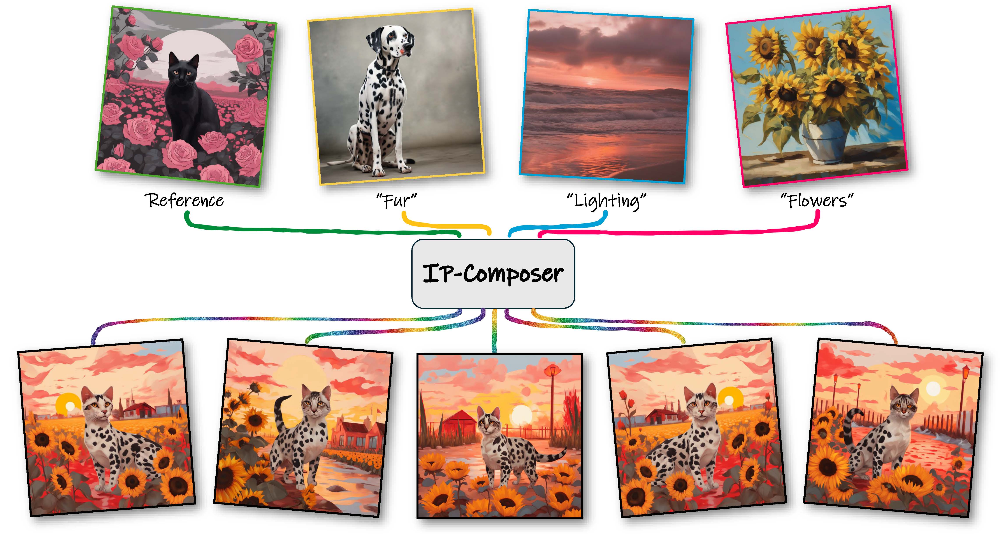

# IP-Composer: Semantic Composition of Visual Concepts

<p>

</p>

*IP-Composer enables compositional generation from a set of visual concepts. These are portrayed through a set of input images, along with a prompt
        describing the desired concept to be extracted from each.*

> Sara Dorfman, Dana Cohen-Bar, Rinon Gal, Daniel Cohen-Or  
> Tel Aviv University, NVIDIA  
> 
> Content creators often draw inspiration from multiple visual sources, combining distinct elements to craft new compositions. Modern computational approaches now aim to emulate this fundamental creative process. Although recent diffusion models excel at text-guided compositional synthesis, text as a medium often lacks precise control over visual details. Image-based composition approaches can capture more nuanced features, but existing methods are typically limited in the range of concepts they can capture, and require expensive training procedures or specialized data. We present IP-Composer, a novel training-free approach for compositional image generation that leverages multiple image references simultaneously, while using natural language to describe the concept to be extracted from each image. Our method builds on IP-Adapter, which synthesizes novel images conditioned on an input image's CLIP embedding. We extend this approach to multiple visual inputs by crafting composite embeddings, stitched from the projections of multiple input images onto concept-specific CLIP-subspaces identified through text. Through comprehensive evaluation, we show that our approach enables more precise control over a larger range of visual concept compositions.


<a href="https://arxiv.org/abs/2502.13951"></a>
<a href="https://ip-composer.github.io/IP-Composer/"></a> 
[](https://huggingface.co/spaces/IP-composer/ip-composer)

## 📝 Description:
Official implementation of the paper "IP-Composer: Semantic Composition of Visual Concepts"

## 🎨 **1. Composition Generation Script**  

### 🚀 **Running the Script**  

Use the following command:  

```bash
python generate_compositions.py --config path/to/config.yaml
```

### ⚙️ Parameters
- `--config_path`: Path to the configuration yaml file.

### 🛠️ Configuration File

The configuration file should be a **yaml** file containing the following keys:

### Explanation of Config Keys

- `base_images_dir`: Path to the directory containing the base images.
- `concepts`: A list of dictionaries, each defining a concept to combine with the base images. Each concept dictionary must include:
  - `concept_name`: A human-readable name for the concept (used for logging or output naming).
  - `images_dir`: Path to the directory containing images for this concept.
  - `embeddings_path`: Path to a `.npy` file with precomputed text embeddings associated with the concept.
  - `rank`: Integer specifying the rank of the projection matrix used for this concept.
- `output_dir`: Directory where the generated composition images will be saved.
- `prompt` (optional): Additional text prompt.
- `scale` (optional): Scale parameter passed to IP Adapter.
- `num_samples` (optional): Number of images to generate per combination.
- `seed` (optional): Random seed.
- `create_grids` (optional): Enable grid creation for visualization of the results.


## 🧠 2. Text Embeddings Script

This repository also includes a script for generating text embeddings using CLIP. The script takes a CSV file containing text descriptions and outputs a `.npy` file with the corresponding embeddings.

### 🚀 Running the Script

Use the following command:

```bash
python generate_text_embeddings.py --input_csv path/to/descriptions.csv --output_file path/to/output.npy --batch_size 100 --device cuda:0
```

### ⚙️ Parameters
- `--input_csv`: Path to the input CSV file containing text descriptions.
- `--output_file`: Path to save the output `.npy` file.
- `--batch_size`: (Optional) Batch size for processing embeddings (default: 100).
- `--device`: (Optional) Device to run the model on.


## 🧪 3. Try the Demo
### 🤗 Online Demo (Hugging Face Spaces)
👉 [**Launch the Demo on Hugging Face Spaces**](https://huggingface.co/spaces/IP-composer/ip-composer)

### 🖥️ Local Demo

To launch the Gradio demo locally, run:

```bash
python demo.py
```

## Citation
If you find this code useful for your research, please cite the following paper:
```
@misc{dorfman2025ipcomposersemanticcompositionvisual,
      title={IP-Composer: Semantic Composition of Visual Concepts}, 
      author={Sara Dorfman and Dana Cohen-Bar and Rinon Gal and Daniel Cohen-Or},
      year={2025},
      eprint={2502.13951},
      archivePrefix={arXiv},
      primaryClass={cs.CV},
      url={https://arxiv.org/abs/2502.13951}, 
}
```
